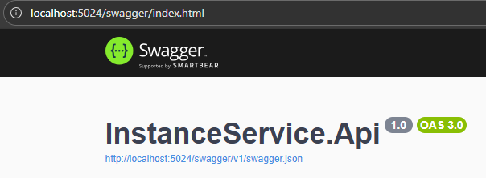
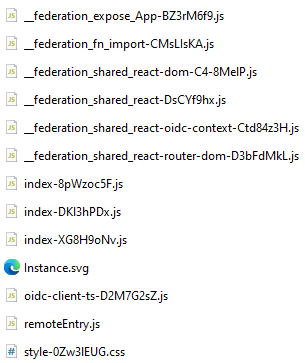

# Introduction

This document will guide you through the installation steps to start the Instance Service in an organized manner.

# Prerequisites

- Ensure that the application `Docker Desktop` is running.
- Follow the installation instructions to locally set up:
  - `Keycloak`
  - `MiniO`
  - `Kafka`
  - `PluginHost Service`
  - `AppOrchestrator`
  - `Ontology Service`
  - `Guideline Service`
  - `UseCase Service`
  - `Access Service`
- Make sure that `Node.js` version 11.4.1 or higher is installed on your computer.
- The local Instance Service runtime uses `PostgreSQL` and `ArcadeDB` with the Gremlin server enabled.

# Technical Guide 

- There are two ways to set up this project. You only need to follow one of the setup options but you need access to the `Docker Image Hub` for both:
  - Click [here](#on-repository-access) on repository access when no docker compose files are provided.
  - Click [here](#on-image-access) when docker compose files are provided.

## On Repository Access

If you previously used the `start-all.bat` for project setup, you can ignore the following instructions and continue with [starting the client](#starting-the-client).

- Clone your project into a local folder.
- Make sure your project is updated to the latest version.
- Navigate to `_docker/`
- Open your command line interface within your current working directory. On Windows, you can use either the `Terminal` or `PowerShell` by right-clicking while holding the `Shift` key and selecting the option that corresponds to your command line interface.
- Execute the following command: `docker compose -p instance-service -f docker-compose.yml -f docker‐compose-override.yml up -d`.

This starts the local Instance Service stack including `instance-postgres`, `instance-arcadedb`, and `instance-server`.

If you can access `localhost:5024/swagger` your InstanceService Server is now ready for use.

The project utilizes a microfrontend architecture. To use the client, continue with [starting the client](#starting-the-client).

## On Image Access

If you previously used the `start-all.bat` for project setup, you can skip the following instructions and proceed with [starting the client](#starting-the-client).

To start the project you should have three files inside the same folder: `.env`, `docker-compose.yml`, and `docker-compose-override.yml`. The contents of these files are not essential for local setup.

The Instance Client does not need to be uploaded manually anymore. You can either run it locally in development mode or let the containerized client be integrated automatically by the AppOrchestrator.

- Open your command line interface within your current working directory. On Windows, you can use either the `Terminal` or `PowerShell` by right-clicking while holding the `Shift` key and selecting the option that corresponds to your command line interface.
- Execute the following command: `docker compose -p instance-service -f docker-compose.yml -f docker‐compose-override.yml up -d`.

This starts the local Instance Service stack including `instance-postgres`, `instance-arcadedb`, and `instance-server`.

If you can access `localhost:5024/swagger` your InstanceService Server is now ready for use.

Now continue with [starting the client](#starting-the-client).

## Starting the Client

There are two supported ways to run the Instance Client:

1. Local development mode
2. Containerized client integrated by the AppOrchestrator

### Local development mode

- Navigate to `Client`.
- Open your command line interface within your current working directory. On Windows, you can use either the `Terminal` or `PowerShell` by right-clicking while holding the `Shift` key and selecting the option that corresponds to your command line interface.
- Execute `npm i`.
- Execute `npm run dev`.

This starts the client locally with the configured development environment. Use this mode when you actively work on the frontend.

### Containerized client via AppOrchestrator

- Start the docker stack as described above.
- Ensure that the `instance-client` container is running.
- The AppOrchestrator discovers the microfrontend metadata from the container labels and binds the client into the Plugin Host automatically.

This mode is the standard runtime setup when you want the client to appear inside the Plugin Host without a manual upload step.

The containerized client exposes the microfrontend metadata through labels such as the route, exposed module, and `remoteEntry.js` path. These are used by the AppOrchestrator for registration.

If one of these two setups is active, you are ready to use the Instance Client.