# Introduction

This document will guide you through the functionalities of the Instance Service.

# Prerequisites

- Your `Instance Server`, `Instance Postgres`, and `Instance ArcadeDB` must run locally inside Docker.
- All other services referenced in the installation instructions must run locally inside Docker:
  - `Keycloak`
  - `MiniO`
  - `Kafka`
  - `PluginHost Service`
  - `AppOrchestrator`
  - `Ontology Service`
  - `Guideline Service`
  - `UseCase Service`
  - `Access Service`
- The `Instance Client` must be available either through local development mode (`npm run dev`) or as a running container that is integrated into the Plugin Host by the `AppOrchestrator`.
- A `valid Guideline` file must be uploaded using the Platform Config plugin.
- A `valid Ontology` file must be uploaded using the Platform Config plugin.
- At least one `use case` must be created using the UseCase client.
- `Access rights` for your classifications must be configured using the Access Client Plugin.

# General Usage

The Instance Client is utilized to manage graphs that consist of nodes representing instances of objects and their respective relationships to one another. For example, a portfolio may represent properties, which can include buildings along with their floors, rooms, doors, technical equipment and systems, sensors, and more. You have the flexibility to define the language and permissible connections by providing a valid guideline and ontology. For example, the international standard IBPDI can be utilized as both the taxonomy and ontology.

The Instance Client provides features to:

- [Create a node](#create-a-node)
- [Interact with a node](#interact-with-nodes)
  - [Create a relation](#create-relations)
  - [Delete relations](#delete-relations)
  - [Updating a node](#update-information)

And further this documentation will provide information about:

- [Table View](#table-view)
- [Node Search](#search-for-nodes)
- [Filter Graphs](#filter-graphs)
- [Color Code of Nodes](#nodes-with-different-access-rights)

## The Toolbar

Everything that is not the canvas itself sits in the header: the UseCase selector, a search for a
single instance, the Cypher query, and the switch between the graph and the table.

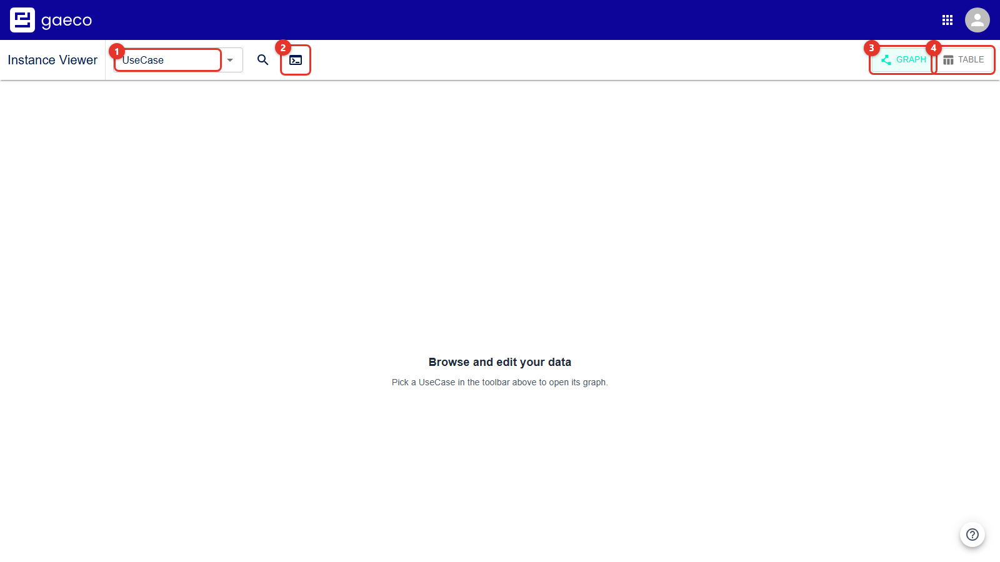

The instance search is offered on the canvas only — the table filters itself.

## Instance

You can create and manage node instances based on classifications configured in the guideline uploaded via the Platform Config Plugin. In this guide, a node is referred to as an `Instance`.

## Relations

You can create and manage node relations based on the ontology that was uploaded using the Platform Config Plugin.

# Create a Node

First, select a Use Case using the Use Case Dropdown.

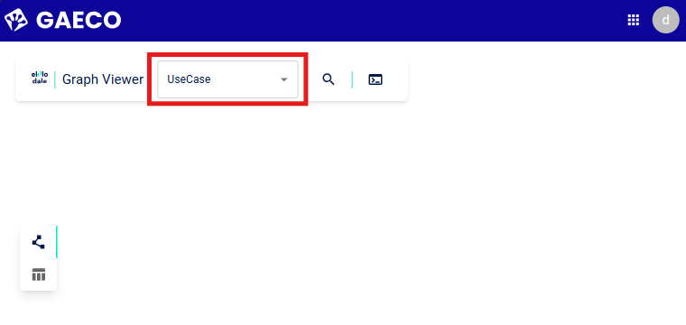

Choose a use case for which you have configured access rights, ideally with at least one property of a classification set to `write`.

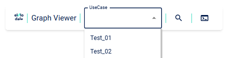

With a UseCase selected, its part of the graph is loaded. A UseCase that has no data yet says so,
and points at the control that creates the first instance.

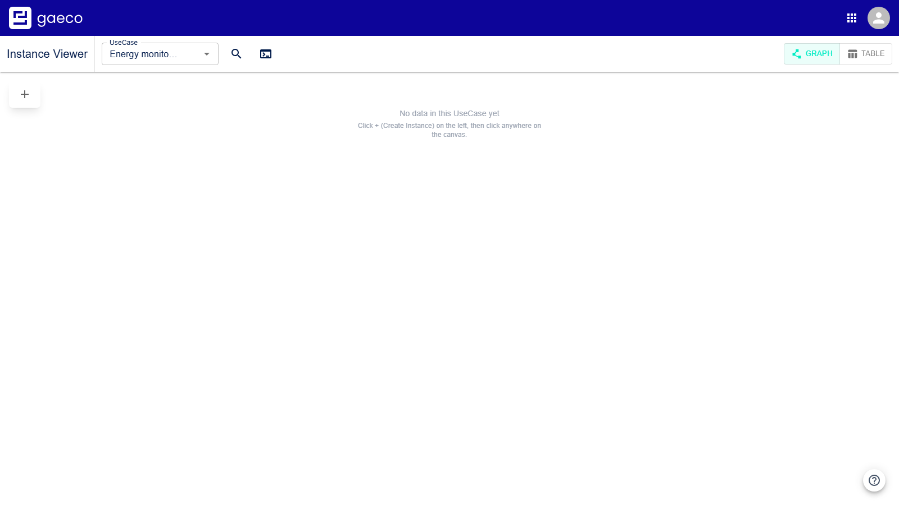

Creator mode opens a panel on the left. The classifications it offers are **only** those your user
group has write access to in this UseCase — which is why the
[Access Rights](https://github.com/gaeco-ekkodale/AccessService) step is a prerequisite rather
than an optional refinement.

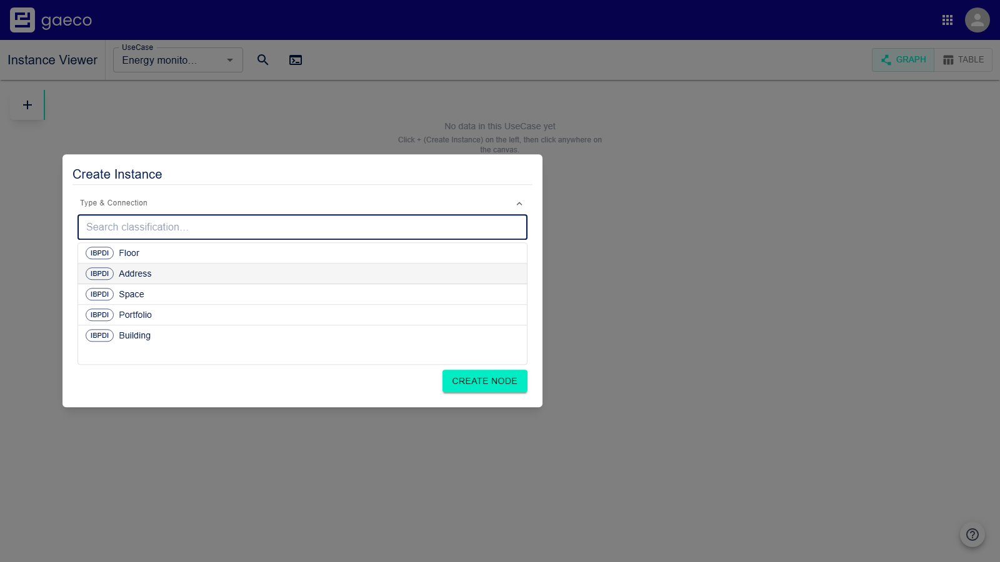

`Create Node` adds it to the canvas.

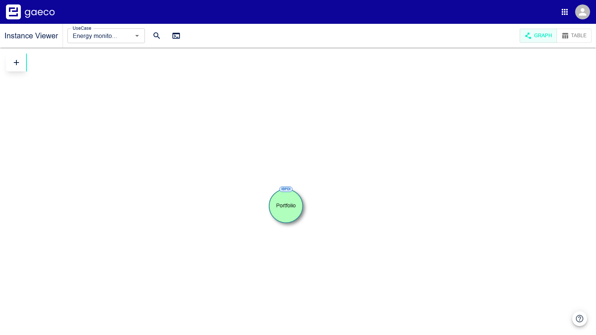

If the canvas stays empty although instances exist, the access rights of your user group are what
decides that — see [Nodes with Different Access Rights](#nodes-with-different-access-rights).

After selecting a use case, you can begin creating your graph by clicking the `+` button on the left side of the screen. This will toggle the [Create Node Mode](#understanding-create-node-mode).

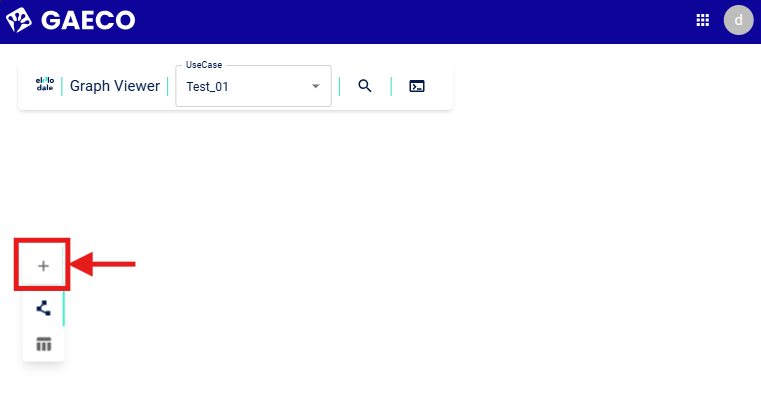

After clicking into an empty area, the create dialog will open, allowing you to create a node for the selected classification.

To add attributes to your new instance, expand the `Attributes` section by clicking on it. In the following example, the `Building` is configured within the `Test_01` use case, featuring one `write` property: `BuildingCode`. If you have write permissions, you can fill in values directly here, but this can also be done later.

Once you are finished, click on `Create Node`. Note that `InstanceName` is a label for instances and is not a property. If a node is read-only, the `InstanceName` cannot be edited.

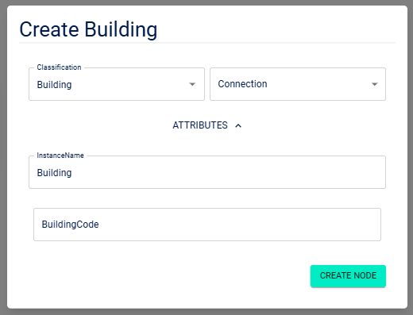

A green node should now appear in the center of your screen.

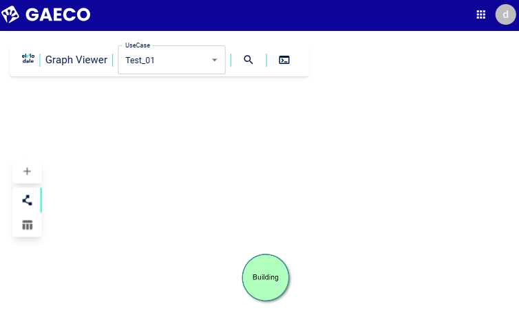

# Interact with Nodes

1. Hover your mouse over the node to see its respective classification.

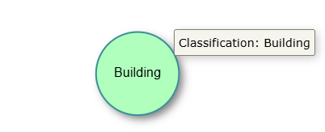

2. Click and hold the left mouse button to drag the node and reposition it as needed.

3. Left-click on the node to update information about it or manage relations. To manage relations, ensure you have created at least one other node, as shown here:

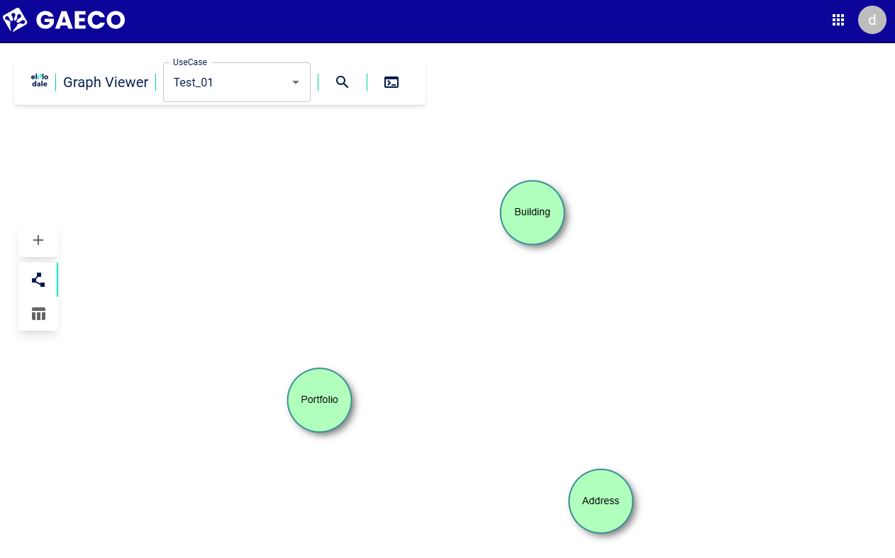

## Create Relations

The ontology we use allows the creation of `hasBuilding` relations originating from an `Address` or `Portfolio` and pointing to a `Building` instance.

When creating new instances or relations, you can use the **Create Node Mode** for a more streamlined workflow. There are three distinct cases depending on where and what you click:

### Understanding Create Node Mode

When you click the `+` button, you enter Create Node Mode with a **crosshair cursor**. This mode allows three different workflows depending on your interactions:

#### Case 1: Create a Standalone Node (Click into Void)

To create a new node without any relations:

1. Click the `+` button to enter Create Node Mode (cursor becomes a crosshair).
2. Click in an empty area of the graph (not on any node).
3. The create dialog will open.
4. Select a classification for your new node.
5. Expand the `Attributes` section to configure properties if desired.
6. Click `Create Node` to complete.

This creates a new standalone node unconnected to any other nodes in the graph.

#### Case 2: Create a Node with a Relation to an Existing Node (Click Node, then Void)

To create a new node that is connected to an existing node:

1. Click the `+` button to enter Create Node Mode (cursor becomes a crosshair).
2. **Click on an existing node** that you want to connect from (the source node).
3. Click in an empty area of the graph (not on any node) and the create dialog will open with additional relation options.
4. Select a classification for your new node.
5. Select a relation type from the `Connection` dropdown that defines how the new node connects to your source node.
6. Expand the `Attributes` section to configure properties if desired.
7. Click `Create Node` to complete.

This creates a new node with an automatic relation linking it to the node you selected in step 2.

#### Case 3: Create a Relation Between Two Existing Nodes (Click Node, then Another Node)

To establish a relation between two nodes that already exist:

1. Click the `+` button to enter Create Node Mode (cursor becomes a crosshair).
2. **Click on an existing node** that you want to be the source of the relation.
3. **Click on a second existing node** that you want to be the target of the relation and the relation dialog will open.
4. Select a relation type from the available relations that connect these two classifications.
5. Click `Create Relation` to complete.

This creates a direct relation between two existing nodes without creating a new node.

### Alternative: Manual Relation Creation via Update Modal

If you prefer more control, you can also create and manage relations through the node's update menu:

1. Click on an existing node to open its update modal (ensure you're not in Create Node Mode).

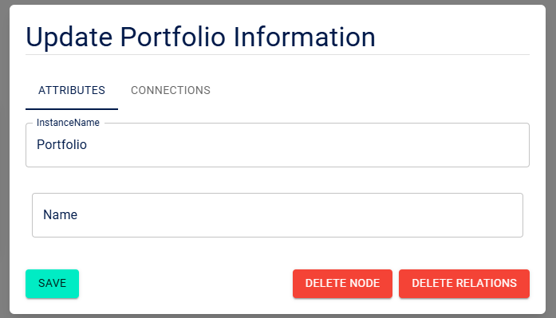

2. Switch to the `Connections` tab.

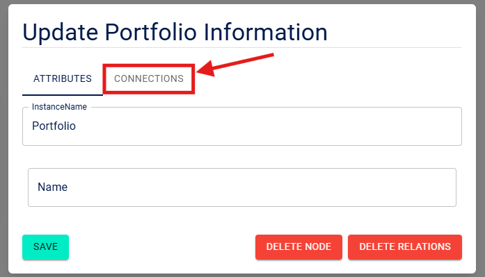

3. Select a classification to establish a relation with by left-clicking on it:

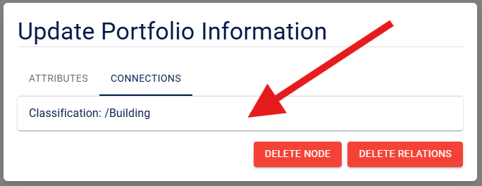

4. All available instances with valid relations will be listed here. Select an available relation and click `Create Connection` to proceed.

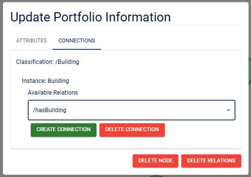

This method allows you to create relations one at a time with more explicit control over the process.

## Delete Relations

### Delete Specific Relations

You can delete a specific relation by following the steps for [creating a relation](#create-relations). Instead of creating a new one, select an existing relation and click on `Delete Connection`.

Refer to this section for more information: ([Nodes with Different Access Rights](#nodes-with-different-access-rights)).

### Delete All Relations

To delete all relations of a node, left-click on the node and select `Delete Relations`.

Refer to this section for more information: ([Nodes with Different Access Rights](#nodes-with-different-access-rights)).

## Update Information

To update information, simply click on a node to open the menu. This will display all the properties you are permitted to modify. After making your desired changes, click `Save` to apply them.

Refer to this section for more information: ([Nodes with Different Access Rights](#nodes-with-different-access-rights)).

# Nodes with Different Access Rights

As you can see in this screenshot, nodes are color-coded by access rights:

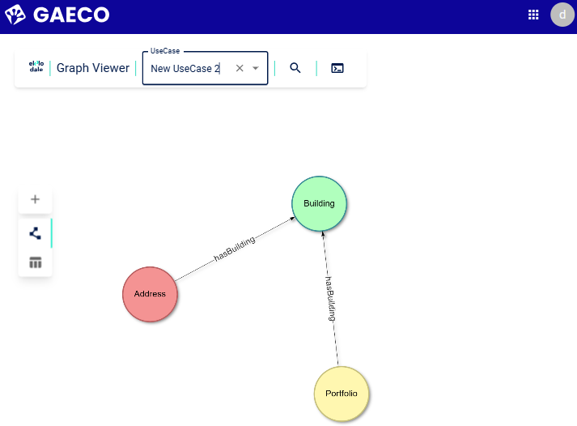

- **Green** indicates `FullControl`:
  - The node can be edited fully.
  - The `Connections` tab is available.
  - The node and its relations can be deleted.

- **Yellow** indicates `ReadWrite`:
  - The node data can be edited.
  - Relation management and deletion are not available.

- **Red** indicates `ReadOnly`:
  - The node can be viewed, but not edited.
  - Relation management and deletion are not available.

- **Very light nodes** indicate that no relevant access rights are available for the current user.

# Search for Nodes

Clicking the magnifying glass icon in the header (`find instance`) opens a search field where you can enter the name of your desired node. Select the desired node to jump directly to it and open the `Update Information` modal.

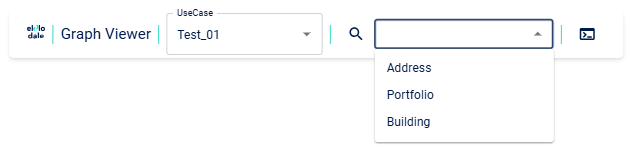

# Filter Graphs

Click the terminal icon next to the magnifying glass (`cypher query`) to open a text field where you can enter Cypher-like syntax for filtering graphs.

To pre-filter the graph for specific nodes and relations according to your needs, refer to the [Federated Query Engine](03-Federated-Query-Engine.md) to learn about creating queries.

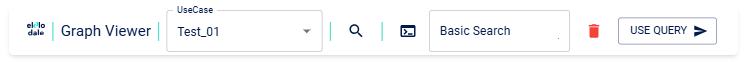

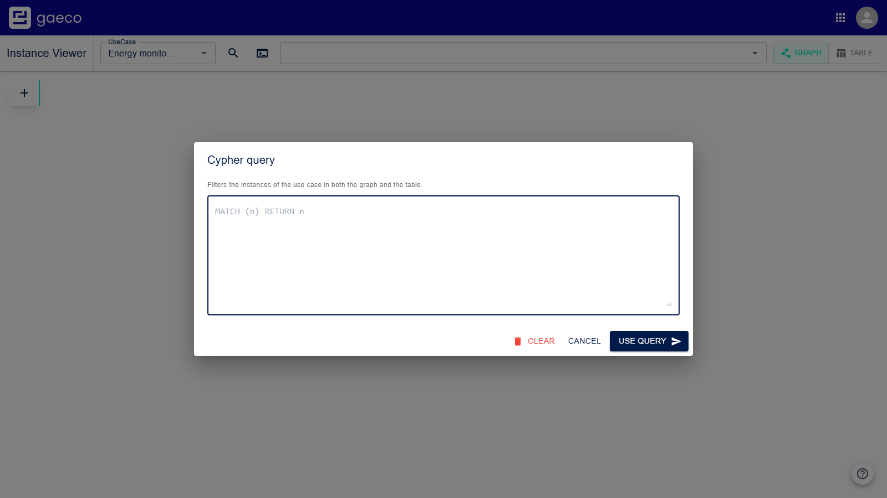

Clicking the red bin icon will completely remove your query, while using the `Use Query` button will apply your filter to the graph data. The query will persist through page refreshes.

# Table View

The switch at the top right changes the display to table mode, showing every instance with its
respective classification. The meanings of the colors are consistent with those represented in the graph view. For further information, please refer to the [Color Code for Node Access Rights](#nodes-with-different-access-rights).

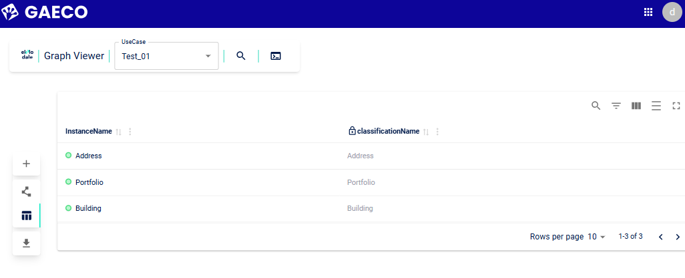

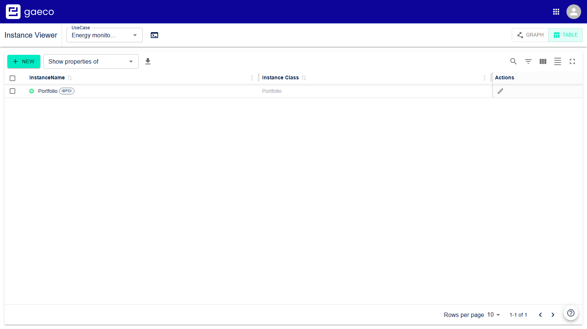

The table has a toolbar of its own: **+ NEW** creates an instance, the **Show properties of**
dropdown picks a classification, and the download icon exports the table.

Selecting a classification adds its properties as columns, grouped the same way as in the create
dialog.

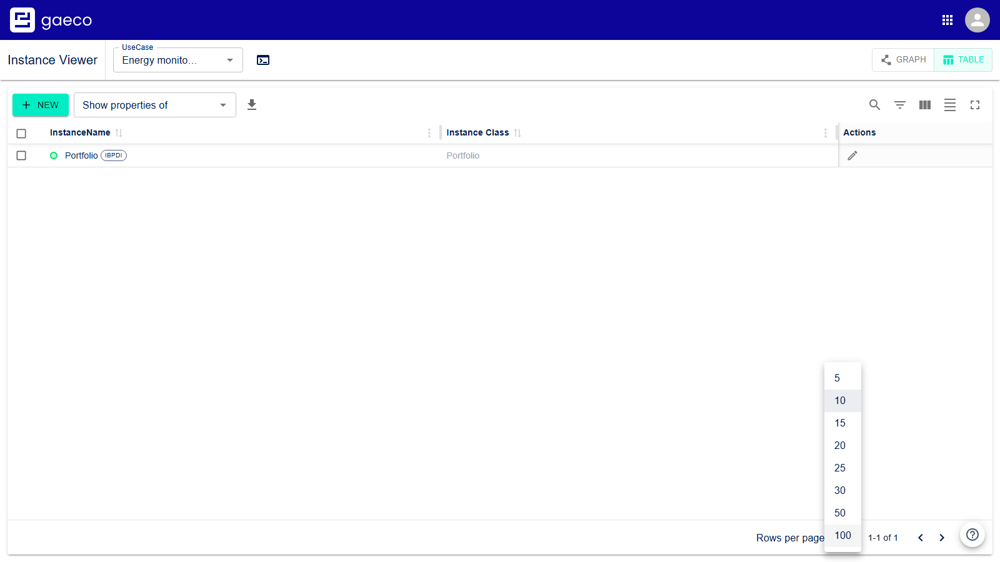

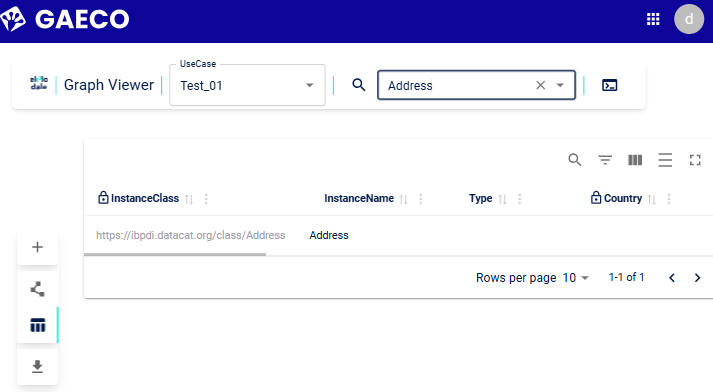

The table will also display access rights by showing a lock for `read` properties. If you have applied filters by [filtering table data](#filtering-table-data), use the download button to download a `.csv` file containing all the filtered table data.

## Change Properties

To modify a property, click on the cell once and enter your desired value. To save your changes, press `Enter`, `Tab`, or click outside the cell to lose focus.

## Filtering Table Data

### General Table Search

The Instance table can be used to filter data and find specific instances. By clicking on the magnifying glass icon, a text input field will open, ready to receive your input. Rows without any matching cell content will be hidden.

### Column Search

For more specific results, columns can be searched for content by using and combining different inputs for each column.

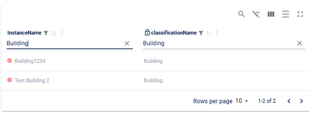

The input field for general table search can also be used in conjunction with column searches.

### Hiding Columns

You can hide any column by clicking the icon featuring three columns and toggling the switch for the desired column.

### Changing Line Spacing

To adjust the line spacing, click the icon displaying multiple rows.

### Fullscreen

The table supports a fullscreen mode that maximizes the size of the table within the current viewport.

### Pagination

For better navigation, pagination displaying 10 rows per page is provided. This default value can be changed using a dropdown menu. Next to the rows per page option, the current number and range of results are displayed. At the far right, there are two arrows pointing left and right, allowing you to select different pages.

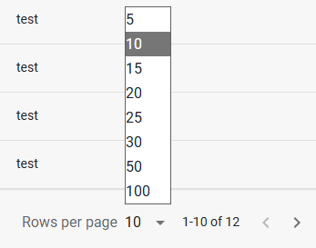.

# The Built-in Tour

The help button replays the module's own walkthrough at any time — creating instances, drawing
relationships, and what to check when something is not offered.

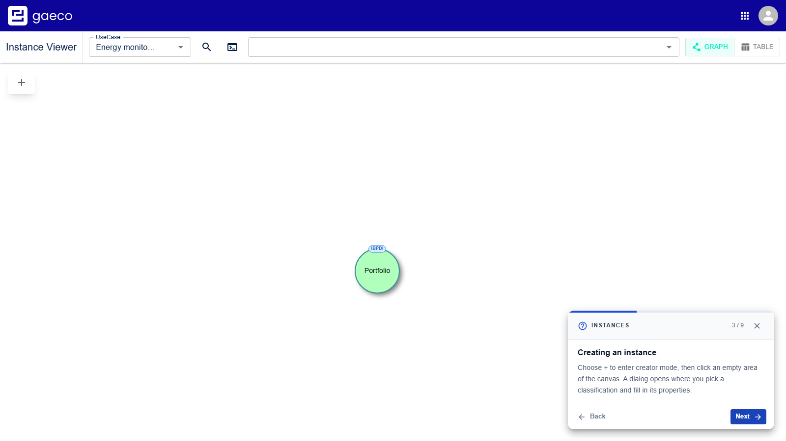

# Related Documentation

- The deployment repository's user guide — preparing a platform from empty
- [Platform Config](https://github.com/gaeco-ekkodale/PlatformConfig) — the guideline and
  ontology that decide what can exist and what can be connected
- [Access Rights](https://github.com/gaeco-ekkodale/AccessService) — what decides which
  classifications and properties are offered here
- [Federated Query Engine](03-Federated-Query-Engine.md) — writing the queries used to filter the
  graph

> **On the screenshots:** files named `client-screenshot-*` are generated by a harness that drives a
> running platform, and are regenerated on every run. Files named `manual-screenshot-*` are kept by
> hand, because they show states a script cannot reach reliably — hover tooltips, the three
> creator-mode cases, and the colour coding of a graph with mixed access rights.
